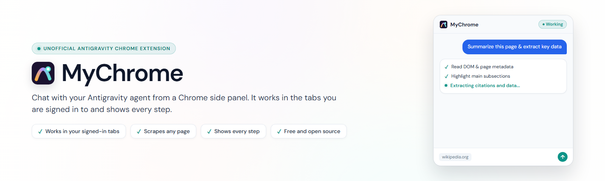
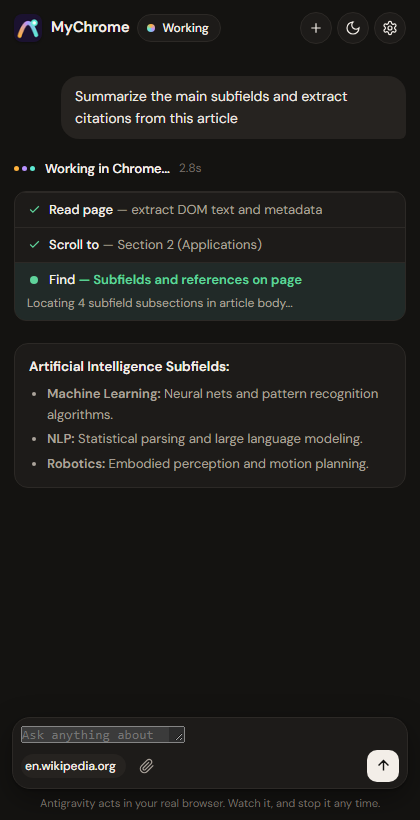

<p align="center">
  <picture>
    <source media="(prefers-color-scheme: dark)" srcset="docs/brand/banner-dark.png">
    
  </picture>
</p>

# MyChrome: Antigravity Chrome extension

MyChrome is a free, unofficial Antigravity Chrome extension. It lets you chat with your Google Antigravity agent from a side panel in Chrome, and the agent reads, clicks, types and scrolls in the tab you have open while you watch each step.

[العربية](#بالعربية)

<p align="center">
  
</p>

## What you can do with it

- **Work on sites where you are signed in.** The browser built into most AI agents runs in a separate profile, so it is logged out of your accounts. MyChrome works in your own Chrome, so the agent can read and analyze your Gmail, LinkedIn, Notion or company dashboards.
- **Scrape data from any page you can open.** Ask for every price on a results page or the job posts in a list, and get them back as a table you can copy.
- **Let it drive the browser.** It navigates, clicks, fills in forms, scrolls and switches tabs for you, and asks first before anything you cannot undo, like sending a message or buying something.
- **Send it files.** Attach images, PDFs or documents in the panel, or a screenshot of the tab, and they go straight to your Antigravity agent.
- **Debug web apps.** It reads the console errors and failed network requests of the tab you are testing.
- **Watch every step and stop it any time.** Each action appears in the side panel with its reason and a screenshot, and a Stop button sits at the bottom of the page.

## Requirements

Google Antigravity installed, signed in and open, plus Google Chrome on Windows, macOS or Linux.

## Install

**1. Ask Antigravity to install it.** Paste this into a new Antigravity conversation and click **Allow** when it asks:

```text
Please install MyChrome for me.
On Windows run:   irm https://raw.githubusercontent.com/ahmeddmakyy/antigravity-chrome-extension/main/install.ps1 | iex
On macOS/Linux:   curl -fsSL https://raw.githubusercontent.com/ahmeddmakyy/antigravity-chrome-extension/main/install.sh | bash
Then show me the full result.
```

**2. Add the extension to Chrome.** Open `chrome://extensions`, turn on **Developer mode**, click **Load unpacked** and paste the folder path the installer copied for you (`~/.gemini/mychrome/extension`). Keep that folder where it is: Chrome loads the extension from it.

**3. Connect.** Restart Antigravity, type `/mychrome` once in a new conversation, then click the MyChrome icon on any tab.

You can also give the task straight from Antigravity: type `/mychrome` followed by what you want, for example `/mychrome summarize my unread Gmail`, and it opens Chrome and does it.

To update, click **Update available** in the panel. To uninstall, ask Antigravity to run the uninstall command from [install.ps1](install.ps1) or [install.sh](install.sh), then remove the extension in `chrome://extensions`.

<details>
<summary>What the installer changes</summary>

| Location | Contents |
|---|---|
| `~/.gemini/mychrome/` | The extension, the helper and the files you attach |
| `~/.gemini/config/plugins/mychrome/` | The Antigravity plugin: skill, MCP helper registration, Stop hook |
| `~/.gemini/config/sidecars/mychrome-waker/` | Wakes the agent when you write in the panel |
| `~/.gemini/config/config.json` | One entry that turns the sidecar on (backed up first) |

MyChrome never reads your Antigravity sign-in. It uses Antigravity's documented plugins, MCP servers, hooks and sidecars.
</details>

<details>
<summary>Troubleshooting</summary>

| You see | Fix |
|---|---|
| **Offline** | Open Antigravity, or quit it completely and open it again. |
| **Not linked** | Type `/mychrome` once in an Antigravity conversation. |
| An orange banner about an old version | Click **Reload** on MyChrome in `chrome://extensions`. |
| "Still working" with no new steps | Antigravity may be waiting for you to approve a tool. |
| Chrome cannot load the extension | The folder was moved or deleted. Repeat install steps 1 and 2. |
</details>

<details>
<summary>FAQ</summary>

**Is this an official Google Antigravity extension?**
No. MyChrome is an independent open-source project. Google and Google Antigravity are trademarks of Google LLC.

**Does it use my Google AI Pro subscription?**
It uses your own Antigravity app, so your Antigravity plan's limits apply.

**Where does my data go?**
Only to your Antigravity app on your computer. Files you attach are saved in `~/.gemini/mychrome/uploads` and deleted after 7 days. MyChrome has no server and collects no analytics.
</details>

## Credits

Built by Ahmed Maky.

<p>
  <a href="https://www.linkedin.com/in/ahmeddmakyy11"> LinkedIn</a>
  &nbsp;·&nbsp;
  <a href="https://ahmeddmakyy.vercel.app"> Portfolio</a>
  &nbsp;·&nbsp;
  <a href="https://t.me/ahmeddmakyy"> Telegram</a>
</p>

## License

MIT. See [LICENSE](LICENSE) and [THIRD_PARTY_NOTICES.md](THIRD_PARTY_NOTICES.md).

---

<div dir="rtl">

## بالعربية

**MyChrome** إضافة Chrome مجانية وغير رسمية لـ Google Antigravity. تتيح لك محادثة وكيل Antigravity من شريط جانبي داخل Chrome، ويقرأ الوكيل التبويب المفتوح أمامك ويضغط ويكتب وينزل فيه، وأنت ترى كل خطوة يقوم بها.

### ماذا يمكنك أن تفعل بها

- **العمل على المواقع التي سجّلت الدخول إليها.** المتصفح المدمج في معظم وكلاء الذكاء الاصطناعي يعمل في ملف تعريف منفصل، فلا يكون مسجّل الدخول إلى حساباتك. أما MyChrome فيعمل داخل Chrome الخاص بك، فيستطيع الوكيل قراءة وتحليل Gmail أو LinkedIn أو Notion أو لوحات التحكم في شركتك.
- **سحب البيانات من أي صفحة تفتحها.** اطلب كل الأسعار في صفحة نتائج، أو الوظائف المعروضة في قائمة، واحصل عليها في جدول جاهز للنسخ.
- **ترك الوكيل يتحكم في المتصفح.** يتنقل بين الصفحات ويضغط ويملأ النماذج وينزل في الصفحة ويبدّل بين التبويبات، ويستأذنك قبل أي خطوة لا يمكن التراجع عنها، مثل إرسال رسالة أو شراء شيء.
- **إرسال ملفات للوكيل.** أرفق صورًا أو ملفات PDF أو مستندات من الشريط، أو لقطة للتبويب، فتصل مباشرة إلى وكيل Antigravity.
- **تصحيح أخطاء تطبيقات الويب.** يقرأ أخطاء الكونسول وطلبات الشبكة الفاشلة في التبويب الذي تختبره.
- **متابعة كل خطوة وإيقافه في أي وقت.** تظهر كل خطوة في الشريط مع سببها ولقطة للشاشة، وزر الإيقاف موجود أسفل الصفحة.

### المتطلبات

تطبيق Google Antigravity مثبّت ومسجّل الدخول بحسابك ومفتوح أثناء الاستخدام، ومتصفح Google Chrome على Windows أو macOS أو Linux.

### التثبيت

1. **اطلب من Antigravity تثبيتها.** الصق رسالة التثبيت الموجودة في قسم [Install](#install) في محادثة جديدة داخل Antigravity، واضغط **Allow** عندما يطلب الإذن.
2. **أضف الإضافة إلى Chrome.** افتح `chrome://extensions`، وفعّل **Developer mode**، واضغط **Load unpacked**، والصق مسار المجلد الذي نسخه المثبّت لك (`~/.gemini/mychrome/extension`). اترك هذا المجلد في مكانه، لأن Chrome يحمّل الإضافة منه.
3. **اربطها.** أعد تشغيل Antigravity، واكتب `/mychrome` مرة واحدة في محادثة جديدة، ثم اضغط أيقونة MyChrome على أي تبويب.

ويمكنك أيضًا إعطاء المهمة مباشرة من Antigravity: اكتب `/mychrome` ثم ما تريده، مثل `/mychrome لخّص رسائل Gmail غير المقروءة`، فيفتح Chrome وينفّذها.

للتحديث، اضغط **Update available** في الشريط. ولإلغاء التثبيت، اطلب من Antigravity تشغيل أمر الإزالة الموجود في [install.ps1](install.ps1) أو [install.sh](install.sh)، ثم احذف الإضافة من `chrome://extensions`.

<details>
<summary>ما الذي يغيّره المثبّت على جهازك</summary>

| المكان | المحتوى |
|---|---|
| `~/.gemini/mychrome/` | الإضافة والبرنامج المساعد والملفات التي ترفقها |
| `~/.gemini/config/plugins/mychrome/` | إضافة Antigravity: المهارة وتسجيل البرنامج المساعد وStop hook |
| `~/.gemini/config/sidecars/mychrome-waker/` | يوقظ الوكيل عندما تكتب في الشريط |
| `~/.gemini/config/config.json` | إدخال واحد يشغّل الـ sidecar (مع نسخة احتياطية أولًا) |

لا يقرأ MyChrome بيانات تسجيل دخولك إلى Antigravity، ويعمل فقط عبر إضافات Antigravity الموثّقة: plugins وMCP وhooks وsidecars.
</details>

<details>
<summary>حل المشكلات</summary>

| ما تراه | الحل |
|---|---|
| **Offline** | افتح Antigravity، أو أغلقه تمامًا وافتحه من جديد. |
| **Not linked** | اكتب `/mychrome` مرة واحدة في محادثة داخل Antigravity. |
| شريط برتقالي عن نسخة قديمة | اضغط **Reload** على MyChrome في `chrome://extensions`. |
| "Still working" بدون خطوات جديدة | ربما ينتظر Antigravity موافقتك على أداة. |
| Chrome لا يستطيع تحميل الإضافة | تم نقل المجلد أو حذفه. كرّر الخطوتين 1 و2 من التثبيت. |
</details>

<details>
<summary>أسئلة شائعة</summary>

**هل هذه إضافة رسمية من Google Antigravity؟**
لا. MyChrome مشروع مستقل ومفتوح المصدر. Google وGoogle Antigravity علامتان تجاريتان لشركة Google LLC.

**هل تستخدم اشتراك Google AI Pro الخاص بي؟**
تستخدم تطبيق Antigravity الموجود عندك، لذلك تنطبق حدود خطتك في Antigravity.

**أين تذهب بياناتي؟**
إلى تطبيق Antigravity على جهازك فقط. الملفات التي ترفقها تُحفظ في `~/.gemini/mychrome/uploads` وتُحذف بعد 7 أيام. لا يملك MyChrome أي خادم، ولا يجمع أي إحصاءات.
</details>

### الترخيص

MIT. راجع [LICENSE](LICENSE) و[THIRD_PARTY_NOTICES.md](THIRD_PARTY_NOTICES.md).

</div>
